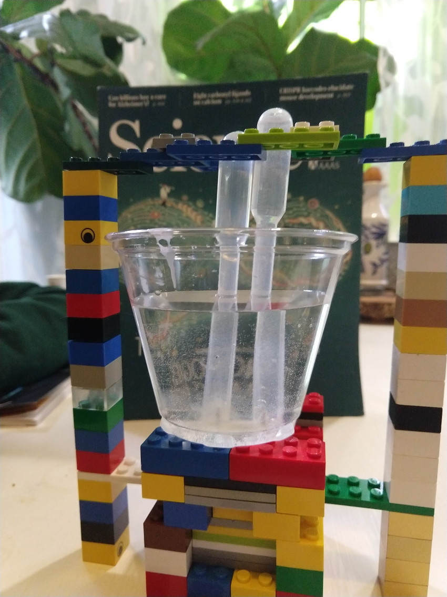

Electrolysis of water is the decomposition of water into oxygen and hydrogen gas due to the passage of an electric current. The reaction has a standard potential of −1.23 V.

 That means if you supply a potential difference greater than 1.23 volts you can split water!  Say with a 9V battery, you can make some gas!!!

 **NOTE:**  The Hydrogen side makes twice as much gas as the oxygen side because it is H2  O.  

 **Double NOTE:** Water Electrolysis is how the International Space Station gets is oxygen.  So you are doing science in the same league (Lego league?) as NASA science!

## Goal
Use simple office supplies and Legos (optional) to separate the hydrogen from the oxygen in water.

## Materials
- [ ] 1 Plastic Cup
- [ ] 2 Thumb tacks
- [ ] 1 Nine Volt Battery
- [ ] pinch of Baking Soda
- [ ] Water: H2O
- [ ] 2 Plastic Pipettes or empty water bottles (optional if collecting the gas)

### Optional Materials
- [ ] Legos

## Time
30 minutes with Legos

## Lesson
It is just fun to just make Hydrogen at home.

Also:
- [ ] Go over what a molecule is, this molecule is H2O.
- [ ] Point out that the pin making the H2 has twice as much bubbles.
- [ ] Connect the moleculer bonds potential to electrical potential.  
- [ ] Internet has has lots of bad information: Many sites (even educational) have one use Salt.  ***SALT produces Chlorine gas*** Not cool.  So one should take care what they read on the internet.

## Level of effort
Easy

## Clean up: Level of effort
- [ ] Easy

## Pointers

* ***DO NOT USE SALT!***

Using NaCl (table salt) in as an electrolyte solution results in chlorine gas rather than oxygen due to a competing half-reaction ([Wikipedia: Water Electrolysis](https://en.wikipedia.org/wiki/Electrolysis_of_water)).

## Why do NASA Scientist uses water electrolysis instead of bringing O2?

### Water
* Dense: Lots of Oxygen per square millimeter
* Not flammable
* Easy to store
* Can use light weight container to store water
    * But, in space everything is weightless!
        * Yes, but it COSTs lots and lots money to ship it to space.  Think ~ $300,000 per pound.

### Oxygen
* Not dense, takes up a lot of space
* Need heavy container (at high pressure) to make Oxygen as dense as water
* FLAMMABLE

## References
* [Excellent Video](https://www.youtube.com/watch?v=HQ9Fhd7P_HA)

* [Wikipedia: Water Electrolysis](https://en.wikipedia.org/wiki/Electrolysis_of_water)

