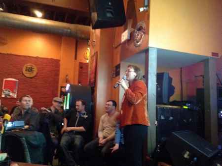

## Public Talks and Tutorials

- [PyOhio Pandas Talks](https://www.evelynboettcher.com/pyohio-pandas#/): July 30, 2022
- [Gem City Ml/AL Meet-Up](https://github.com/ejboettcher/GemCity-ML-AI_Random): (July 21) ML/AI to test randomness of my random number generator. 

- Dayton Django Girls Workshop: (April 2022): Coached and modified the official tutorial to
  make it doable in a day.  
- Gem City Tech: Presented on [Processing Large Data](https://www.youtube.com/watch?v=OJIa7UkRteI) (2021)
- STEM Outreach: [WPAFB: Educational outreach](https://www.youtube.com/watch?v=9x0lPsfbQdo) (2021)
- Pub Science: [*Lights, Camera, H-Bar*](https://drive.google.com/file/d/0BzCwhHRUxz7Yc2RnR3otOUZPelk/view?usp=sharing):
 Calculate Plank's constant while drinking a beer with LEDs.
 {: .align-right}
- Dayton Data Visualization Talks: Gave multi-talks at the Dayton Data Visualization group. Talks were designed to be mini-ted-like talks which focused on data and visualizations.

  - [Focusing on the Flow with Dot](https://docs.google.com/presentation/d/1DfbmtCJKQVGnex6X4_0GPhgitkCi0a6fufh2VAqx6sI/edit?usp=sharing)
  - [Image Mensuration: a primer](https://docs.google.com/presentation/d/1ocA8uSUfBn_IC0QpfUIivTeDuRHp3eCnN-fjJv9Zmss/edit?usp=sharing)
  - [Resolve Your Sheep](https://docs.google.com/presentation/d/162ondZKzfNKs0l6v197epxRxYeJz64x9AQoJrN2q1oU/edit?usp=sharing)

- Dayton Regional STEM Center- Dropping the Beat (2013-4)
Worked with Dayton area teachers and other AFRL colleagues to create a lesson plan on sound called “Dropping the Beat”. This was a multi-month project that ended with the completion of a STEM lesson plan.

## Science Saturday 



Backyard science with common household equipment. Goal is to show that science is:

* Interesting
* Does not need expensive equipment 
* Something you can do at home 
* A kid (at heart too) can do alone
  * Adult supervision RECOMMENDED
* Emphasize that science is all around us and not just something that happens in a lab.
  * One way to do that, is to use everyday objects to do science.
* Doable in less than an hour

