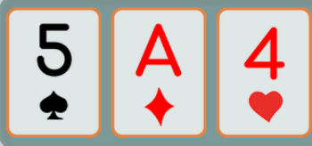

This is a small collection things I wrote for fun.  
They are not included in publications.  
Publications are my published public academic / industry papers.

## One Twenty One

A multiplication version of 21 / BlackJack.  The game is designed to help the user increase their ability to do mental math.  All cards are multiplied together. There is one addition that you can place anywhere between the cards.  {: .align-right}

Game invented, designed and built by Evelyn J. Boettcher

[One Twenty One the game](https://www.onetwentyone.games)

## This is Four

A short picture book, (before I knew about inkscape) on how to multiply any two numbers less than 10 on your fingers.  The trick is to use bases other than base 10.

[Ebook: This is Four](https://www.barnesandnoble.com/w/this-is-four-evelyn-boettcher/1103238863;jsessionid=EFEAAB19EBA0C1B26938AE33A)

